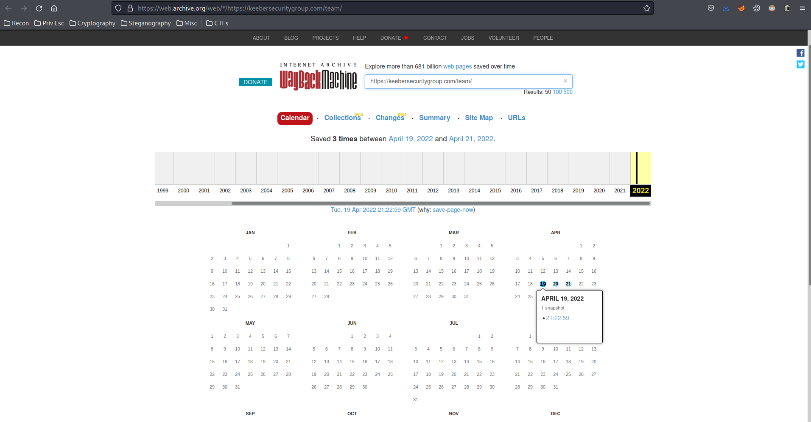
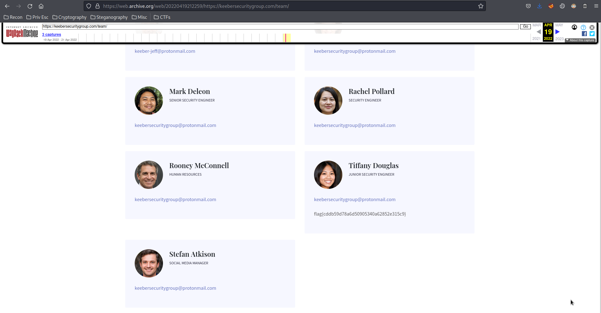
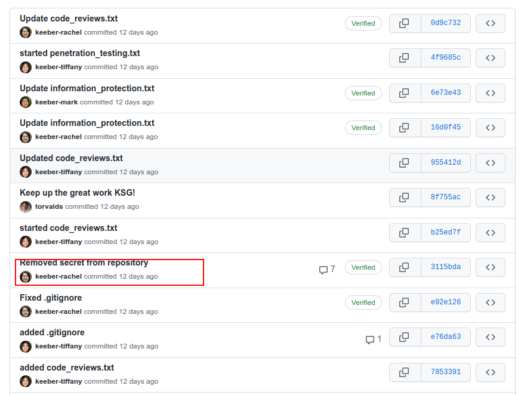
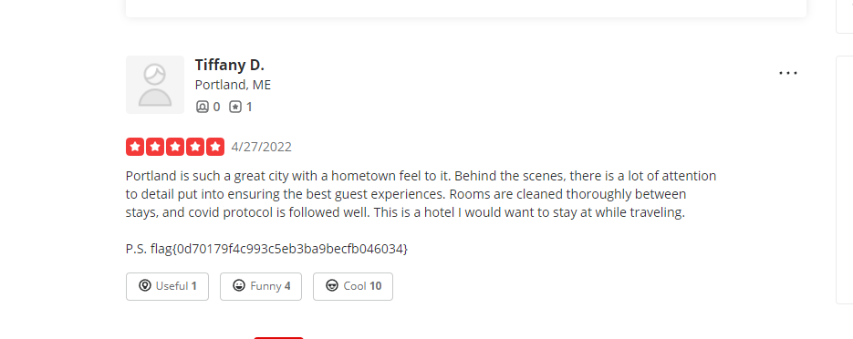

# Keeber Security Group
#easy #medium #osint 

Challenge ini terdiri dari beberapa pertanyaan mengenai OSINT pada keebersecuritygroup. Skill yang dibutuhkan:
- Github info finding
- Documentation research
- Wayback Machine
- Geo-int
- Email OSINT

## Pertanyaan 1
You have been applying to entry-level cybersecurity jobs focused on reconnaissance and open source intelligence (OSINT). Great news! You got an interview with a small cybersecurity company; the Keeber Security Group. Before interviewing, they want to test your skills through a series of challenges oriented around investigating the Keeber Security Group.   
  
The first step in your investigation is to find more information about the company itself. All we know is that the company is named Keeber Security Group and they are a cybersecurity startup. To start, help us find the person who registered their domain. The flag is in regular format.

**Solusi**
- Googling dengan keyword: 'Keeber Security Group'  


- Masuk ke dalam webnya: https://keebersecuritygroup.com/  

- Dapatkan informasi dengan whois  
```
whois keebersecuritygroup.com
```


## Pertanyaan 2
The Keeber Security Group is a new startup in its infant stages. The team is always changing and some people have left the company. The Keeber Security Group has been quick with changing their website to reflect these changes, but there must be some way to find ex-employees. Find an ex-employee through the group's website. The flag is in regular format.  
  
**Solusi**  
- Masuk ke dalam link team: https://keebersecuritygroup.com/team/  

- Coba dengan menggunakan wayback machine: https://archive.org/web/ dan search `https://keebersecuritygroup.com/team/`  

- Ini adalah daftar lama tim Keeber Security Group  


## Pertanyaan 3
The ex-employee you found was fired for "committing a secret to public github repositories". Find the committed secret, and use that to find confidential company information. The flag is in regular format.  

**Solusi**
- Menuju ke github milik Keebersecuritygroup: https://github.com/keebersecuritygroup/  
- Di dalam security-evaluation-workflow, terdapat banyak commit. Kita cari commit dengan deskripsi menarik.  

- Ternyata di dalam commit itu, terdapat asana_secret yang dihapus dari repository.  

- Baca dokumentasi asana untuk penggunaan token tersebut: https://developers.asana.com/docs  

- Dari hasil riset dokumentasi, coba menggunakan token tersebut dengan `curl`  


## Pertanyaan 4
The ex-employee also left the company password database exposed to the public through GitHub. Since the password is shared throughout the company, it must be easy for employees to remember. The password used to encrypt the database is a single lowercase word somehow relating to the company. Make a custom word list using the Keeber Security Groups public facing information, and use it to open the password database The flag is in regular format.  
  
(Hint: John the Ripper may have support for cracking .kdbx password hashes!)  

**Solusi**
- Masuk ke repo password-manager pada github  

- Cobalah masuk ke dalam text ini: https://github.com/keebersecuritygroup/security-evaluation-workflow/blob/main/code_reviews.txthttps://github.com/keebersecuritygroup/security-evaluation-workflow, terdapat kata aneh yang mungkin bisa menjadi password: righla, cotableat, frizzonaire, musitionently, textbols, bryanklets, dll. Buatlah wordlist dengan menggunakan kata ini.
- Buat file hash untuk di-crack dengan `keepas2john`.  

- Crack dengan `john`  

- Buka dengan aplikasi `KeepasXC` dan password cracurrelss  
  
flag{9a59bc85ebf02d5694d4b517143efba6}
  
Note: Tool ini bisa berguna dalam membuat wordlist [CeWL](https://github.com/digininja/CeWL)

## Pertanyaan 5
The ex-employee in focus made other mistakes while using the company's GitHub. All employees were supposed to commit code using the keeber-@protonmail.com email assigned to them. They made some commits without following this practice. Find the personal email of this employee through GitHub. The flag is in regular format.  
  
**Solusi**
- Clone git di bawah ini  


- Email biasanya dapat diekstrak dari informasi commit, kita bisa menggunakan `git log` untuk melihat isi commit.  


- Dapat flag pada commit dengan email tif.hearts.science@gmail.com  


Note:
- Kita bisa lihat secara lebih detail dari github, carilah commit yang sudah sesuai dengan di atas.  

- Link: https://github.com/keebersecuritygroup/security-evaluation-workflow/commit/b25ed7f5aa72f88c0145a3832012546360c2ffc2

- tambahkan `.patch` pada link tersebut: https://github.com/keebersecuritygroup/security-evaluation-workflow/commit/b25ed7f5aa72f88c0145a3832012546360c2ffc2.patch  


## Pertanyaan 6
Challenge Description: After all of the damage the ex-employee's mistakes caused to the company, the Keeber Security Group is suing them for negligence! In order to file a proper lawsuit, we need to know where they are so someone can go and serve them. Can you find the ex-employee’s new workplace? The flag is in regular format, and can be found in a recent yelp review of their new workplace.

(Hint: You will need to pivot off of the email found in the past challenge!)  

**Solusi**
- Kita gunakan username tif.hearts.science dari email tif.hearts.science@gmail.com yang didapatkan sebelumnya. Kita bisa temukan bahwa username tersebut dipakai di Instagram.  


- Ada beberapa bukti yang dapat kita ambil dari IG tersebut:
	- Tiffany sudah tidak bekerja sebagai developer
	- Tiffany bekerja di bagian hospitality di tempat barunya.

- Pada gambar di bawah, kita melihat terdapat watermark Google, gambar ini diambil dari Google Maps dan kita perlu cari lokasinya.  


- Dari hasil OSINT sebelumnya, kita dapatkan bahwa lokasi kantor lama Tiffany berada di Maine, Portland. Pada caption di atas, Tiffany mengatakan bahwa ini adalah pelabuhan Ferry yang dipakai untuk berangkat kerja.  


- Kita dapatkan lokasinya. Foto yang persis diambil pada tahun 2015.  


- Dari Instagram Tiffany, kita ambil tempat dengan waktu jalan sekitar 20 menit dari lokasi Ferry, punya taman dalam (courtyard), dan punya kolam renang indoor. 


- Dari satellite view Maps:  


- Courtyard dari Maps:  


- Indoor pool dari Maps:  


- Review di Yelp: https://www.yelp.com/biz/residence-inn-by-marriott-portland-downtown-waterfront-portland?sort_by=date_desc.  


## Pertanyaan 7
Challenge Description: Multiple employees have gotten strange phishing emails from the same phishing scheme. Use the email corresponding to the phishing email to find the true identity of the scammer. The flag is in regular format.

(Note: This challenge can be solved without paying for anything!)  


**Solusi**
- Kita akan gunakan tool untuk mencari email pada web [epiepos](https://epieos.com/)dan [holehe](https://github.com/megadose/holehe)  
  

  

  

- Pivot pencarian ke MySpace, karena cheerios mencantumkan Justin Beiber. MySpace merupakan platform yang sering digunakan untuk sharing musik. Ternyata nama Isaac Anderson cukup banyak dan kita perlu mencari satu per satu.  
  

- Perhatikan seksama apabila flag muncul di suatu tempat.  
  


## Pertanyaan 8
Challenge Description: Despite all of the time we spend teaching people about phishing, someone at Keeber fell for one! Maria responded to the email and sent some of her personal information. Pivot off of what you found in the previous challenge to find where Maria's personal information was posted. The flag is in regular format.

**Solusi**
- Untuk mencari username di web lain, kita bisa gunakan tools sherlock: https://github.com/sherlock-project/sherlock
- Gunakan sherlock ke username `cereal_lover1990`  

- Flag bisa ditemukan pada url `Pastebin`  


## Source
https://github.com/drewd314/Nahamcon-CTF-2022-Keeber-OSINT-Writeups
