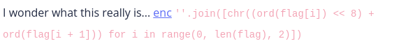

# Transformation
#pico #easy #reverseengineering 

## Challenge
  
.  
Terlihat dari challenge di atas bahwa flag disamarkan dengan menggabungkan 2 karakter ASCII menjadi 1 karakter UTF-16. ASCII memiliki panjang 8 bit, sedangkan UTF-16 memiliki panjang 16 bit.

Karakter1 = 0000 0000
Karakter2 = 1111 1111

Penggabungan karakter = 0000 0000 1111 1111

Karakter yang digabungkan tersebut dibuat menjadi 1 karakter pada UTF-16. 

## Solve
Challenge tersebut dapat diselesaikan dengan script di bawah ini.
```python
#!/usr/bin/env python3
file = "enc"
flag = ""

with open(file, "r") as f:
    strings = f.read()
    for i in range(len(strings)):
        ordinal = ord(strings[i]) >> 8 # finding ordinal of these characters
        ordinal2 = bin(ord(strings[i]))[9:]
        print(ordinal2)
        ordinal2 = int(ordinal2, 2)
        flag += chr(ordinal) + chr(ordinal2)

print(flag)

# output
# picoCTF{16_bits_inst34d_of_8_26684c20}
```

Tantangan ini bisa diselesaikan dengan menggunakan CyberChef dengan opsi magic.